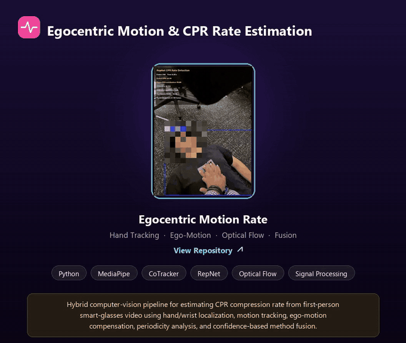

# Hybrid CPR Compression Rate Estimation

Egocentric smart-glasses CPR video → hybrid computer-vision pipeline for chest-compression-rate
(CPM) estimation. Combines classical motion analysis (MediaPipe hand tracking, CoTracker point
tracking, RANSAC ego-motion compensation, Farneback optical flow, CWT/autocorrelation/FFT/peak
rate estimators) with an independent learned repetition counter (RepNet), fused with
confidence-weighted, disagreement-aware voting. See `docs/method_card.md` for intended use,
limitations, and observed failure modes.

[](https://github.com/hooriaakhann/xrcare_cpr_pipeline)

```text
Development smart-glasses video
              ↓
        MediaPipe Hands
              ↓
     Dynamic CPR foreground
              ↓
       CoTracker points
              │
              │
Full frame ───┼──→ Background features
              │             ↓
              │      RANSAC affine
              │             ↓
              │       Camera motion
              ↓             ↓
       Corrected tracker trajectory
              │
              ├───────────────┐
              │               │
              │          Farneback Flow
              │               ↓
              │        Residual CPR flow
              │               │
              └───────┬───────┘
                      ↓
               Motion waveform
                      ↓
               Butterworth filter
                      ↓
       ┌────────┬────────┬────────┐
       ↓        ↓        ↓        ↓
      CWT     AutoCorr   FFT     Peaks
       │        │        │        │
       └────────┴────┬───┴────────┘
                    │
                    │
Stabilized video → RepNet
                    │
                    ↓
           Confidence-weighted
                 fusion
                    ↓
              FINAL CPM
                    +
             confidence score
                    ↓
              Compare to GT
```

See `docs/architecture.md` for the same pipeline as a Mermaid diagram plus a module map
(which `src/hybrid/*.py` file implements each box above).

**Development-set only.** Per CLAUDE.md, this pipeline is implemented, tuned, and evaluated
exclusively on `data/split/*_development.mp4`. The held-out `*_test.mp4` videos stay completely
unseen until the pipeline is finalized and frozen — nothing in this repo runs, inspects, or
reports on them.

## Project structure

```
config/
└── default.yaml            # every tunable parameter -- see src/hybrid/config.py for the schema

data/
├── raw/                     # original videos -- never modified (gitignored)
├── processed/                # trimmed/orientation-corrected full-frame videos (gitignored)
├── split/                    # *_development.mp4 / *_test.mp4 (gitignored)
└── metadata/                 # ground truth, timestamp sidecars, trim config (tracked in git)

docs/
├── architecture.md          # Mermaid pipeline diagram + module map
├── method_card.md           # intended use, limitations, observed failure modes
└── adr/                      # architecture decision records (one per non-obvious design choice)

models/                      # pretrained checkpoints, downloaded on demand (gitignored)
runs/
├── development/<video_id>/   # per-video diagnostics (Phase 16) + overlay.mp4 (hybrid.overlay_video) -- gitignored, regenerable
└── experiment_ledger.jsonl   # append-only log of every dev run / tuning iteration

src/
├── hybrid/                  # the main pipeline package (see docs/architecture.md)
├── preprocessing/            # Phase 0: raw video inspection + trim/rotate preprocessing
└── repnet_env/                # RepNet's vendored model code -- runs in the isolated .venv-tf

tests/                        # one test file per src/hybrid module, plus one real integration test
```

## Setup

```
python -m venv .venv
.venv\Scripts\python -m pip install -e ".[dev]"
.venv\Scripts\python -m pip install torch --index-url https://download.pytorch.org/whl/cpu
.venv\Scripts\python -m pre_commit install
```

(`make setup`, aliased to `make install`, does the same three steps.) RepNet needs a second,
isolated environment — see ADR 0003 for why:

```
make install-repnet
```

Pretrained checkpoints (MediaPipe HandLandmarker, RepNet) are downloaded automatically on
first use, pinned by URL + sha256 (`src/hybrid/models.py`) — never fine-tuned.

## Usage

```
# lint + fast test suite (excludes slow/model-download tests)
make test

# full suite including real-model tests (needs network on first run)
make test-all

# coverage report
make coverage

# run the full pipeline on every development video
make run-dev
# .. equivalently: .venv\Scripts\python -m hybrid.run_development

# run it on one specific development video
make run-dev VIDEO=data/split/video3_development.mp4
```

`hybrid.run_development` refuses anything that isn't a `*_development.mp4` file (Phase 18) —
there is no test-video equivalent script, intentionally, until the pipeline is frozen.

## Development-set results

Generated by `hybrid.evaluation.run_development_evaluation` over all 6 development videos
(post-prediction comparison to GT only — GT is never an input to inference, CLAUDE.md rule 5),
with the config as tuned in Phase 15 (`fusion.disagreement_scale_cpm=5.0`, see PROGRESS.md).
Development-set numbers only — tuning/debugging signal, not a generalization claim; the
held-out test set stays untouched until the pipeline is frozen.

| video | GT CPM | final CPM | signed error | overall confidence |
|---|---:|---:|---:|---:|
| video1 | 90.00 | 92.98 | +2.98 | 0.492 |
| video2 | 69.23 | 68.70 | -0.53 | 0.434 |
| video3 | 105.88 | 104.21 | -1.67 | 0.524 |
| video4 | 72.00 | 70.01 | -1.99 | 0.447 |
| video9 | 94.74 | 98.04 | +3.30 | 0.390 |
| video10 | 100.00 | 99.81 | -0.19 | 0.651 |

**MAE = 1.778 CPM (95% CI [0.883, 2.680]), RMSE = 2.117, mean signed error = +0.317**
(essentially unbiased). Every video within ~1-5% relative error of GT.

See `PROGRESS.md` (Phase 13/14 entries) for the ablation comparison (8 sub-pipelines) and the
paired Wilcoxon significance test (full hybrid vs. best single-branch ablation: not
statistically significant at n=6 — reported honestly, not oversold) — generated by
`hybrid.ablation.run_ablation_comparison`. Those numbers predate Phase 15's tuning
(`disagreement_scale_cpm` was still 10.0) and weren't rerun against the new default — the
ablation study's structural conclusions (hybrid beats any single branch, RepNet's domain
mismatch, video2's CoTracker+affine drift) aren't sensitive to that one scalar, but the exact
MAE figures in those entries are from the pre-tuning config.

## Held-out test-set results

The pipeline has been run once, under a frozen config (git tag `frozen-for-test-v1`), against
the 4 held-out test videos. **Test MAE (4.851) is 2.7x dev MAE (1.778); test RMSE (5.562) is
2.6x dev RMSE (2.117)** — a real generalization gap, reported as found, not adjusted for. See
`docs/test_results.md` for the full per-video table, the dev-vs-test comparison, and three
findings from this run: a shared-signal explanation for video6's error (the four classical
estimators aren't independent evidence — they read one common fused waveform), a new
confidence-doesn't-track-accuracy limitation, and a check that the errors aren't systematically
directional. Nothing in the pipeline changed in response to these numbers.

## Design notes (Phase 0/1 preprocessing)

- **No spatial cropping / ROI at the preprocessing stage.** Full frame is preserved so later
  stages (MediaPipe, CoTracker, RANSAC ego-motion, RepNet) all have the complete frame to work
  with; ROI cropping happens dynamically per-frame inside the pipeline (Phase 2), never
  permanently on the source video.
- **No resolution/FPS standardization.** Source videos share a consistent aspect ratio
  (~3:4 portrait) but not identical pixel dimensions; all run ~30fps but are VFR (see below) —
  neither dimension is forced to match since no downstream algorithm requires it.
- **Source videos are variable frame rate (VFR).** Frame-to-frame timing is not constant
  (varies ~25-42ms between frames even though the average is ~30fps). `hybrid.video_io`'s
  `VideoReader` pairs every decoded frame with its real `ffprobe`-derived PTS rather than
  assuming `1/FPS`; the one place a uniform sample rate is unavoidable (Butterworth filtering,
  Phase 8) resamples explicitly and keeps that as a clearly separate artifact rather than
  reinterpreting the original timestamps.
- **Processed videos stay HEVC 10-bit (`yuv420p10le`)**, matching the source. Verified OpenCV
  (FFMPEG backend) decodes both the raw source and the re-encoded output correctly before
  committing to this codec.
