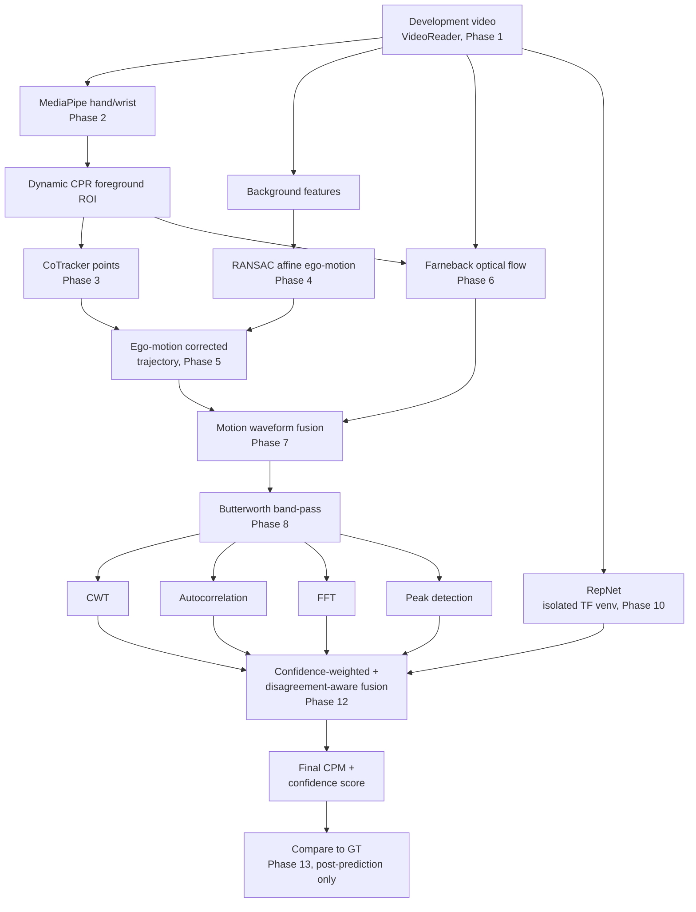

# Architecture

One development video (`data/split/<id>_development.mp4`) flows through the branches below.
Every arrow is a real module boundary in `src/hybrid/`; caching (Phase 0.5) sits transparently
in front of every expensive branch (MediaPipe, CoTracker, ego-motion, optical flow, RepNet) so
re-running downstream phases during tuning never re-runs them unless their own config changed.

## Module map

| Stage | Module | Result type |
|---|---|---|
| Video I/O | `hybrid.video_io` | `Frame`, `VideoReader` |
| Dev-set / GT | `hybrid.dataset` | `DevVideo`, `GroundTruth` |
| MediaPipe | `hybrid.mediapipe_roi` | `MediaPipeVideoResult` |
| CoTracker | `hybrid.cotracker_tracker` | `CoTrackerVideoResult` |
| Ego-motion | `hybrid.ego_motion` | `EgoMotionVideoResult` |
| Corrected trajectory | `hybrid.corrected_trajectory` | `CorrectedTrackerResult` |
| Optical flow | `hybrid.optical_flow` | `OpticalFlowVideoResult` |
| Motion wave fusion | `hybrid.motion_wave` | `MotionWaveResult` |
| Butterworth filter | `hybrid.filters` | `FilterResult` |
| 4 classical estimators | `hybrid.estimators` | `AllEstimatesResult` |
| RepNet | `hybrid.repnet_branch` (+ `src/repnet_env/`, isolated venv) | `RepNetResult` |
| Confidence collection | `hybrid.confidence` | `BranchConfidences` |
| Final fusion | `hybrid.fusion` | `FusionResult` |
| Dev-set evaluation | `hybrid.evaluation` | `VideoEvaluationResult`, `DevelopmentEvaluationResult` |
| Ablation comparison | `hybrid.ablation` | `AblationSummary` |
| Diagnostics | `hybrid.diagnostics` | `runs/development/<id>/*` |
| Entrypoint | `hybrid.run_development` | CLI, Phase 18 guard |

## What's deliberately not shown

Confidence flows alongside every arrow above (not drawn, to keep the diagram readable) —
CoTracker visibility and ego-motion confidence feed Phase 7's `tracker_weight`, optical-flow
validity feeds `flow_weight`, and all five CPM-producing branches' own confidences feed
Phase 12's fusion weights directly. See `hybrid.confidence`'s module docstring for the
complete list of how each is computed, and ADR 0004 for why fusion doesn't stop at
confidence alone.
